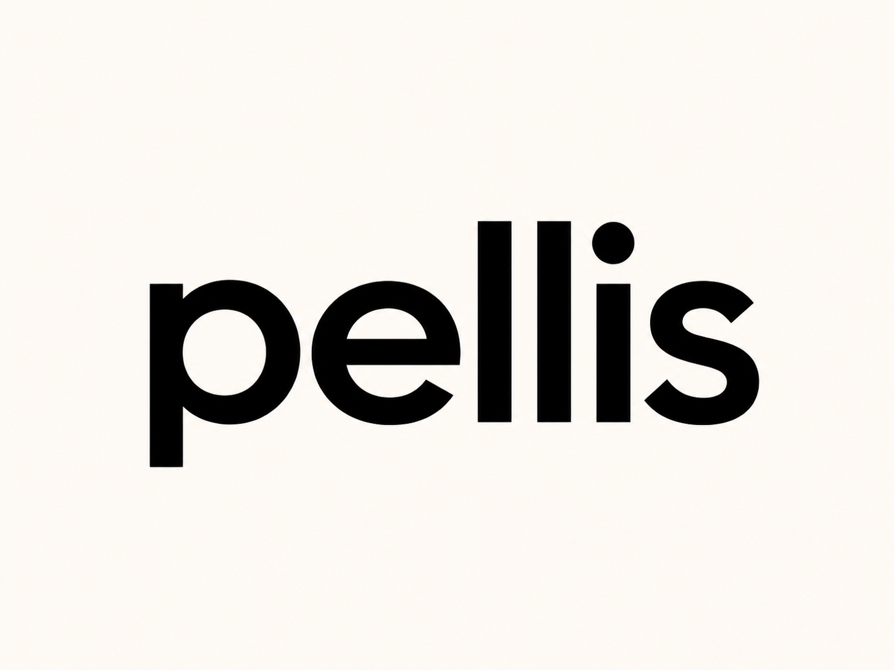

<p align="center">
  
</p>

<p align="center"><strong>The open foundation for AI on the body.</strong></p>

<p align="center">
  <em>Open hardware. Open models. Open future.</em>
</p>

---

> **Status: day one.** This is an early-stage, open-source project run as a side
> project. There is **no company**, no shipping hardware, and no dev kit you can
> buy yet. What lives here today is the foundation — the vision, the licensing,
> and the governance. The hardware spec and reference library land next. If you
> want to shape it from the start, you're in the right place.

## What Pellis is

Pellis *(pronounced **PELL-iss**)* is an open platform for **AI that lives on the
body and helps you physically** — not AI on a screen, not a chatbot. Sensors read
what your body is doing, an on-device model reasons about it in real time, and an
actuator (today: a haptic cue) acts on the body to change the outcome. Think of it
as an **open second skin** for embodied AI.

The loop is simple and it runs on the body, in real time:

```
  sense  →  reason  →  act  →  observe  →  adapt
```

The arc is a spectrum, climbed one rung at a time:

> **sense → coach → assist → augment**

It starts at the simplest useful rung — passive sensing with a haptic cue, in soft
clothing, useful enough that real people wear it for real reasons — and climbs from
there over years.

## Why it's open

The closest analog is **Pixhawk**: an open flight-control primitive that an entire
commercial drone industry was built on top of. Open the primitive, and an ecosystem
builds the products. Foundation technology this hard — soft PCBs, conductive yarn,
washable power, on-device ML, garment-scale manufacturing — does not mature inside
one company's wallet on one company's clock. It matures across communities, on open
artifacts, the way Linux, ROS, PyTorch, and Pixhawk did.

Open isn't a value statement here. It's the only strategy with non-zero odds from
where this starts. The full reasoning lives in the launch essay (linked when it's
published).

## What's open vs. reserved

| Open | Reserved |
|---|---|
| Hardware design files | The PELLIS trademark |
| Firmware & the device library | Customer data (if/when there are customers) |
| Reference models (trained on public data) | Premium model pipelines & weights |
| Documentation | Certification work |
| The community model zoo | Brand & relationships |

The defensible parts of any eventual company live in data, models, brand, and
relationships — never in a dev-kit schematic. See [`LICENSING.md`](LICENSING.md) for
the per-artifact license scheme (CERN-OHL-S v2 / Apache-2.0 / CC-BY).

## Get involved

Pellis is built by collaborators. Everyone starts as a collaborator; anyone who ends
up owning a layer of the platform becomes its maintainer. The rules are written down:

- **[GOVERNANCE.md](GOVERNANCE.md)** — how collaborators, maintainers, and the project lead work
- **[CONTRIBUTING.md](CONTRIBUTING.md)** — how to get involved
- **[CODE_OF_CONDUCT.md](CODE_OF_CONDUCT.md)** — the baseline for working together

The most useful thing you can offer right now is an honest reaction to the direction:
where it's wrong, where it's right, where you'd push harder.

---

<p align="center"><em>Open hardware. Open models. Open future.</em></p>
